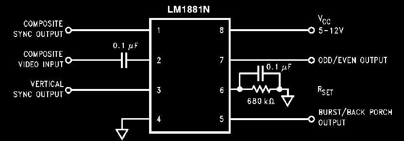

# Sync-Based-Video-Analyzer

Project ini bertujuan mendeteksi video dri kabel RCA dengan tujuan untuk mendeteksi
--- freeze
--- Blank
--- No signal

Ide utamanya adalah menggunakan mikrokontroler untuk membaca sinyal analog dari OUT RCA nya
kemudian sample nya di simpan pada array yang menyimpan frame, lalu membandingkan frame baru dengan frame lama

## LM1881
LM1881 adalah IC yang berfungsi untuk mengekstrak timing sinyal dri OUT RCA tersebut, dengan begitu MCU dapat
mengetahui kapan untuk memulai pengambilan sample 

